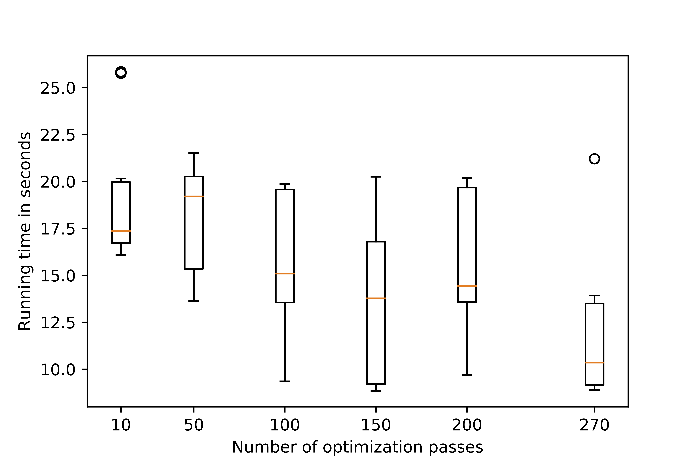

+++
title = "ML based phases ordering with LLVM"
extra.author = "Qian Huang and Horace He"
extra.bio = """
Qian Huang is a junior undergraduate studying CS and Mathematics.

Horace He is a senior undergraduate studying CS and Mathematics.
"""
+++

In this project, we continued to experiment with ML based phases ordering as in project 2, but using c++ programs and LLVM instead. Compared with project 2 using Bril, there are a lot more infrastructure supports for this project: more available optimization passes, actual hardware performance counters and benchmark programs. These allowed us to explore this topic more.

# Design Overview

## Analysis

We first analyzed how much the ordering of optimization passes affects program performances. We selected the 270 optimizations used in LLVM `-O2` level as the set of optimizations we analyzed across the whole project. We performed all optimizations on the streamcluster program in PARSEC benchmark.



For each n optimization passes n, we uniformly randomly select n optimization passes with replacement (so there can be duplicate paths) and run 10 times to obtain a range of performance. From the figure, we see that the ordering of optimizations does affect the overall program performance significantly. In fact, some order of optimizations even makes it significantly worse. As the number of passes used increases, we can see that the optimal performance improvement indeed increases but saturated around 100 in terms of the best optimization performances. Thus we can find a smaller and better optimization sequence.

## Methods

### Hill Climbing

One popular approach for phase ordering is Hill Climbing: selecting the optimization that gives the most performance boost at each step. However, it can be really expensive to rebuild and run 270 times at every step, while also rerun the program multiple times to reduce performance variance. In fact, it could take more than a day to build even 15 passes. In the experiment, we sampled 5 optimizations at each step instead of trying all and only used one run performance to save the time.

### Linear Regression

We built a simple linear regression model to predict how much one optimization pass will improve over the performance of the current program, based on a set of performance counters we selected from ones provided by [likwid-perfctr](https://github.com/RRZE-HPC/likwid). During inference time, we will run the model to approximate Hill Climbing algorithm, i.e. greedily select the best pass based on model prediction at each step, until we reach the maximum number of passes limit or there are no more optimizations that will improve the performance.

## Evaluation

### Hill Climbing baseline

We constructed a optimization sequence of length 100 using Hill Climbing for the program stream cluster:

```
-loop-distribute -basicaa -instsimplify -aa -lazy-block-freq -domtree -loops -simplifycfg -block-freq -called-value-propagation

-lazy-branch-prob -opt-remark-emitter -basicaa -loop-rotate -correlated-propagation -basicaa -instcombine -simplifycfg -aa -scalar-evolution

-basicaa -simplifycfg -lazy-value-info -aa -transform-warning -basicaa -domtree -aa -basicaa -jump-threading

-loop-accesses -loops -lcssa-verification -domtree -loop-distribute -lazy-block-freq -speculative-execution -instcombine -loops -block-freq

-early-cse -loops -lazy-branch-prob -loop-simplify -domtree -prune-eh -loop-rotate -lcssa-verification -tti -lazy-block-freq

-globalopt -loops -lazy-branch-prob -prune-eh -lcssa -targetlibinfo -aa -loops -mem2reg -constmerge

-basicaa -aa -loop-simplify -loop-unswitch -loop-unroll -basicaa -basicaa -block-freq -tbaa -lazy-branch-prob

-block-freq -lazy-block-freq -basicaa -basicaa -tti -basicaa -basicaa -lazy-branch-prob -loops -opt-remark-emitter

-functionattrs -simplifycfg -loop-simplify -lazy-branch-prob -lazy-block-freq -block-freq -aa -branch-prob -lazy-branch-prob -transform-warning

-aa -domtree -branch-prob -basiccg -scalar-evolution -gvn -lazy-block-freq -basicaa -opt-remark-emitter -loop-accesses
```

The performance changing is plotted as bellow as passes are added (the box plots are same as in the analysis):


As shown in the figure, Hill Climbing gives the almost optimal results.

### Linear Regression

To collect data points of program performance counters, optimization pass and performace difference, we randomly sampled optimization sequences as in the analysis but with random length. We then collect the runtimes and performance counter values without the last optimization as features. The performance counters we used are:

Clock per Instruction, Branch Misprediction Ratio, Instructions per Branch, % Cycles without Execution, % Cycles Without Execution due to L1D, % Cycles Without Execution due to L2, % Cycles Without Execution due to memory loads, Packed Single Precision MFLOP/S, Packed Double Precision MFLOP/S

Eventually we collected 170 data points within reasonable time. We then fit a linear regression model to predict normalized performance improvement. The coefficient R^2 = 0.067, meaning that the features we collected are only slightly correlated with the performance difference. Similarly we also tried to fit a linear classifier to predict whether the performace will increase. The accuracy turns out to be 0.58, which is a bit better than always guessing true.

### Extensions and Improvement

With the noisy data we collected so far, it is unlikely that we can construct a meaningful order. It would probably be better if we can collect more data points, but even generating 1000 data points will take a whole day. Besides, we would also like to collect data on more programs that are smaller but more diverse. The other programs in PARSEC that we managed to build take too long time to compile once. 

In the future, we can try finding better benchmarks and collect a more informative dataset.
